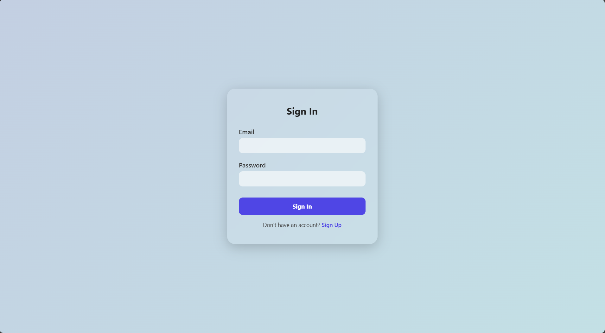

# GlassAuth (ChatGPT)

"GlassAuth" is a beautifully designed, modern authentication UI built using HTML, CSS, and JavaScript. Featuring a sleek glassmorphism aesthetic, it provides users with a seamless and responsive experience for signing in or creating an account.

## Live Project :
https://aicomp-sketch.github.io/GlassAuth/Source%20Code/
